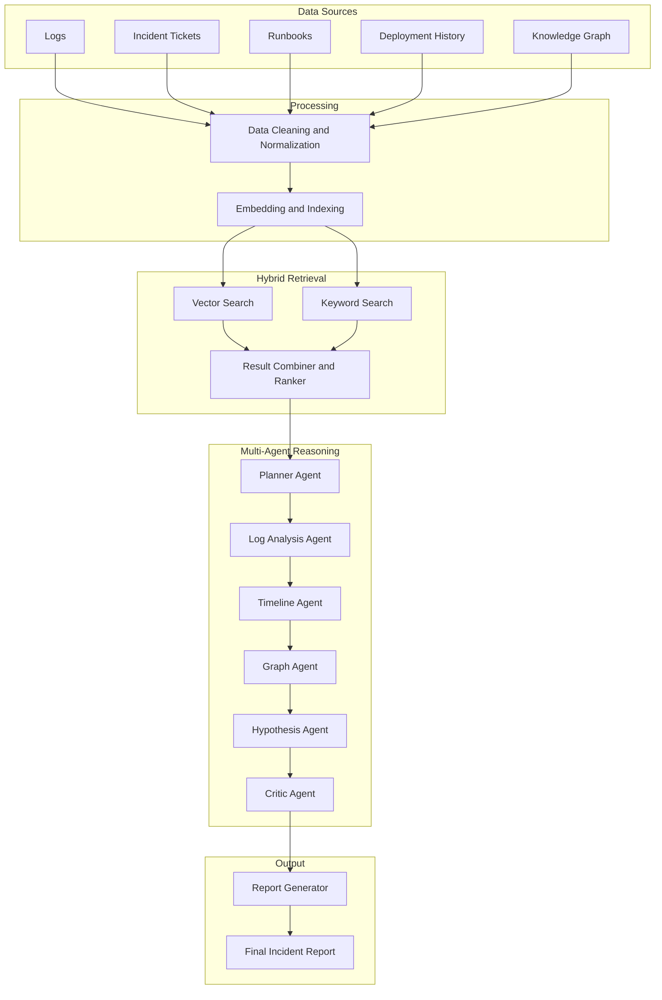

# AI-Powered-Incident-Investigation-System

## System Architecture

The platform performs end-to-end incident investigation by combining hybrid retrieval, multi-agent reasoning, and knowledge graph analysis.

## Environment Variables

Make sure to create a `.env` file in the root directory if required by your scripts, with necessary API keys and configuration.

### Architecture Overview

### Investigation Flow

1. Ingest and normalize data from operational logs, incident tickets, runbooks, deployment metadata, and graph entities.
2. Build embeddings and indexes for semantic retrieval and fast keyword retrieval.
3. Run hybrid retrieval to improve recall and precision before reasoning.
4. Execute specialized agents in sequence to plan, correlate, validate, and challenge hypotheses.
5. Generate a structured final report with evidence, confidence, and action recommendations.

### Final Incident Report Schema

The report should include:

- Root cause analysis
- Timeline of events
- Affected services
- Supporting evidence with citations
- Confidence score
- Recommended actions

## Prerequisite GenAI Knowledge for This Course

### Retrieval-Augmented Generation (RAG)

Combines retrieval from external data sources (logs, tickets, docs) with LLMs to generate grounded, context-aware responses.

### Multi-Agent Systems

Uses multiple specialized agents that collaborate to decompose tasks, analyze data, and generate structured outputs.

### Knowledge Graphs

Represents system entities and their relationships to enable dependency analysis and impact tracing.

### Multi-Hop Reasoning

Connects information across multiple sources (logs, deployments, graph) to derive root cause insights.

### Evaluation and Grounding

Ensures outputs are accurate, evidence-based, and free from hallucinations through validation and scoring.

## Phase 1: Data Sourcing

To ensure both realism and controlled complexity, the dataset for this project will be created by combining multiple sources.

### Data Source Strategy

1. Kaggle or public datasets
2. LLM-generated synthetic data

### Kaggle or Public Datasets

Used to introduce real-world patterns, noise, and variability in data.

#### Recommended Dataset

IT Incident Management Dataset (available on Kaggle)

#### Dataset Contents

- Ticket descriptions
- Priority levels
- Issue categories
- Resolution notes

#### Purpose in This Project

- Enable historical reasoning based on past incidents
- Identify recurring patterns and common failure types
- Simulate realistic user-reported issues and system behavior

### LLM-Generated Synthetic Data

Used to simulate specific scenarios such as failures and edge cases, while preserving controlled experimentation.

To simulate realistic production scenarios, synthetic data should intentionally include:

- Noise in logs and tickets
- Inconsistencies across sources
- Partial or missing information

This helps mimic real-world systems and stress-test root cause investigation workflows.
